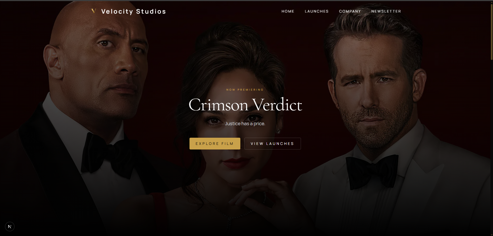
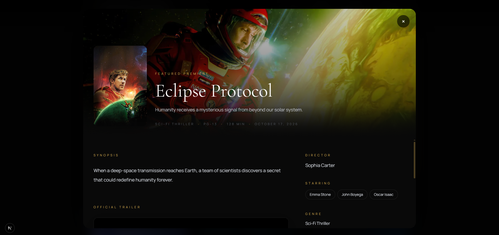
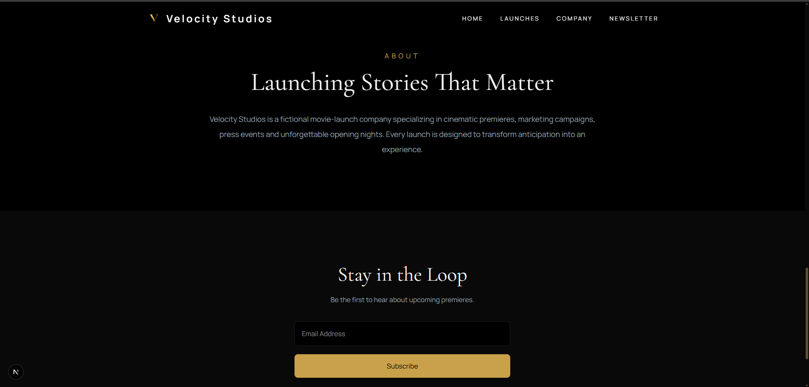

<p align="center">
  <table>
    <tr>
      <td>
        
      </td>
      <td>
        <h3 style="margin: 0;">Velocity Studios</h3>
      </td>
    </tr>
  </table>
</p>

### Desktop

| Hero                      |
| ------------------------- |
|  |

| Movie Grid                        |
| --------------------------------- | 
|  |

| Movie Modal                |
| -------------------------- |
|  |

| Newsletter                      |
| ------------------------------- |
|  |

### Mobile

| Hero                               | Grid                               | Modal                               |
| ---------------------------------- | ---------------------------------- | ----------------------------------- |
|  |  |  |

---

## Tech Stack

| Category | Technologies |
|----------|--------------|
| **Frontend** | Next.js 16, React 19, TypeScript, Tailwind CSS, Framer Motion |
| **Backend** | Laravel, PHP, MySQL |


## Project Structure

| Path | Description |
|------|-------------|
| `api/` | Laravel backend |
| `frontend/` | Next.js frontend |
| `screenshots/` | Project screenshots |
| `README.md` | Project documentation |

```text
Movie-Launch/
├── api/
├── frontend/
├── screenshots/
└── README.md
```


## Run Locally

### Backend (API)

| Step | Command |
|------|---------|
| Navigate to API | `cd api` |
| Install dependencies | `composer install` |
| Copy environment file | `cp .env.example .env` |
| Generate application key | `php artisan key:generate` |
| Run migrations & seed database | `php artisan migrate --seed` |
| Start development server | `php artisan serve` |

**API URL**

| Service | URL |
|---------|-----|
| Laravel API | `http://127.0.0.1:8000` |


### Frontend

| Step | Command |
|------|---------|
| Navigate to frontend | `cd frontend` |
| Install dependencies | `npm install` |
| Start development server | `npm run dev` |

**Frontend URL**

| Service | URL |
|---------|-----|
| Next.js App | `http://localhost:3000` |


## API Endpoints

| Method | Endpoint | Description |
|--------|----------|-------------|
| `GET` | `/api/films` | Retrieve all films |
| `POST` | `/api/newsletter` | Subscribe to the newsletter |


## Trade-offs

Prioritized a polished cinematic user experience over dedicated movie detail pages. Film information is presented in an animated modal, reducing navigation while keeping the interface responsive and immersive.


## Live Demo

*Not deployed.*


## Author

**Brian Mutune**
